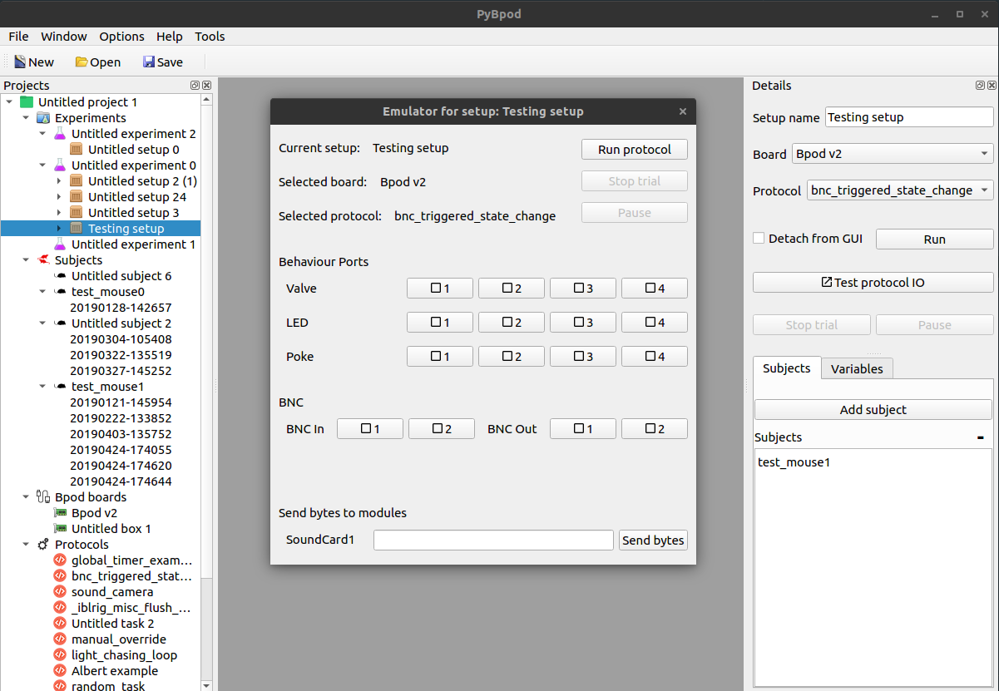

=====
Usage
=====

After installing the plugin (please see :ref:`installation`),
a new *Test protocol IO* button will appear in each of the
already configured Setups.

.. warning::
    At the moment, it is required that a Bpod device is connected to the computer to run the module.

.. note::
    The button will only be *active* when there is both a valid board and protocol selected in the Setup details.

When pressing the button, with a Bpod device connected, the window presented in the next figure will appear.

   PyBpod's Main window with the Emulator Window opened

At the top of the window it is possible to see the selected Setup, the selected Board and protocol. The buttons that
are also available in the Setup details of PyBpod are also available in the Emulator window (i.e., Run, Stop trial and
Pause).

Afterwards, a section with the Behaviour Ports is presented with three rows of buttons, each button for each available
port. Each row represents the Valve, LED and the Poke.

.. note::
    The Emulator window will **adapt automatically** depending on the Bpod device version connected. For example, when
    connecting a Bpod v0.7, each row for the Behaviour Ports will present 8 buttons, representing the 8 Behaviour
    Ports available in that model.

After the Behaviour Ports, a section with the BNC connections is displayed, with two buttons for the inputs and two for
the outputs.

For Bpod v0.7 a new section with the Wire connections will appear after the BNC connections as it is possible to see in
the next figure.

   Emulator Window for Bpod v0.7

When modules are connected to Bpod, they will also show up at the bottom of the window so it will be possible to send
serial messages to those modules using the Emulator.

Interaction
===========

To use the Emulator it is required, at the moment, that a device is connected and that a procolol is running. As such,
the first step is to run the protocol using the appropriate button.

While the protocol is running, when pressing the different buttons for different actions, different events can or will
be triggered.

As an example, if the Poke button 1 is pressed once (active state), it will trigger the 'Port1In' event.
If pressed again (disabled state), it will trigger the 'Port1Out' event. As such, when running the following example
protocol, which will change state when the 'Port1Out' event occurs, the PWM1 output channel (LED) will be turned on
during the 3 seconds duration of the state 'Port3LightOn' after pressing twice on the Poke button 1, with both the
'Port1In' and 'Port1Out' events being triggered by Bpod as if there was a real contact in the Poke of the Behaviour Port.

.. code-block:: python

    from pybpodapi.protocol import Bpod, StateMachine

    my_bpod = Bpod()

    sma = StateMachine(my_bpod)

    sma.add_state(
        state_name='Port1LightOn',
        state_timer=1,
        state_change_conditions={'Port1Out': 'Port3LightOn'},
        output_actions=[])

    sma.add_state(
        state_name='Port3LightOn',
        state_timer=3,
        state_change_conditions={Bpod.Events.Tup: 'exit'},
        output_actions=[(Bpod.OutputChannels.PWM1, 255)])

    my_bpod.send_state_machine(sma)

    my_bpod.run_state_machine(sma)

    print("Current trial info: {0}".format(my_bpod.session.current_trial))

    my_bpod.close()
